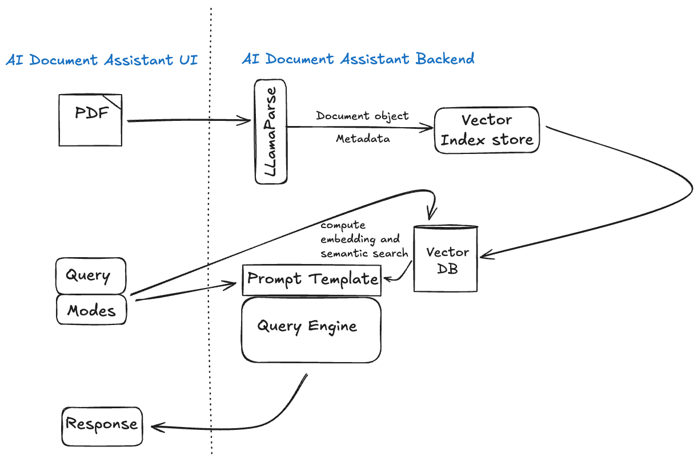

# Assistant-Chat-Assistant – Documentation & Setup Guide

This app is a Retrieval-Augmented Generation (RAG) assistant for your PDFs. Upload a document, pick a mode, and chat to get summaries, explanations, or teaching-style guidance grounded in the file you uploaded.

## Architecture



## Modes

- **Summarize**: multi-granularity summaries (local HuggingFace LLM)
- **Explain**: focused explanations and definitions (local HuggingFace LLM)
- **Teach**: agentic tutoring flow (Groq LLM + optional web search)

## Key Features

- **Robust PDF parsing**: LlamaParse with automatic fallback to `SimpleDirectoryReader`
- **Semantic chunking**: sentence/semantic split with overlap
- **Vector DB**: Qdrant (Cloud or localhost); automatic in-memory fallback
- **Citations**: answers include compact source snippets
- **Streamlit UI**: sessionized chat per-file and per-mode

## Requirements

- Python 3.11
- Poetry 1.8+
- Optional: Docker (to run Qdrant locally)

## Environment Variables

Create a `.env` at the repo root if you plan to use Groq or LlamaParse, or Qdrant Cloud:

```bash
# Teach mode (Groq)
GROQ_API_KEY=your_groq_key

# LlamaParse (optional; improves PDF parsing)
LLAMA_PARSE_API_KEY=your_llama_parse_key

# Qdrant Cloud (optional; if not set, tries localhost:6333 then in-memory)
QDRANT_URL=https://YOUR-QDRANT-URL
QDRANT_API_KEY=your_qdrant_api_key

# Local Qdrant fallback settings (used if QDRANT_URL is not set)
QDRANT_HOST=localhost
QDRANT_PORT=6333

# HF cache (local and in Docker)
HF_HOME=./.models/hf
TRANSFORMERS_CACHE=./.models/hf
```

Notes:
- The app checks `QDRANT_URL` first (Cloud). If absent, it tries `QDRANT_HOST:QDRANT_PORT`. If unreachable, it falls back to an in-memory store.
- Teach mode requires `GROQ_API_KEY`.

**Clone the repository**
   ```bash
   git clone <repository-url>
   cd ai_-_devices_interview
   ```

## Local Development (Streamlit)

1. Install deps
   ```bash
   poetry install
   ```

2. Run the app
   ```bash
   poetry run streamlit run src/app.py
   ```

3. Demo flow
   - Upload a PDF
   - Choose one of: Summarize, Explain, Teach
   - Ask a question → see the answer with citations


Modes: `summarize`, `explain`, `teach`. For `teach`, set `GROQ_API_KEY`.

## Qdrant (recommended)

Run Qdrant locally via Docker:

```bash
docker run --rm -p 6333:6333 -p 6334:6334 qdrant/qdrant:latest
```

If Qdrant is unreachable, the app will transparently use an in-memory vector store (good for quick demos).

## Docker (app container)

This repo includes a Dockerfile that runs the Streamlit app. It exposes port 8080 and honors `$PORT` (Render-style) at runtime.

Build and run locally:

```bash
docker build -t ai-doc-app:latest .
docker run --rm -it --name aidoc -p 8080:8080 -e PORT=8080 --env-file .env ai-doc-app:latest
# open http://localhost:8080
```

Persist HuggingFace cache between runs:

```bash
docker run --rm -p 8080:8080 --env-file .env \
  -v "$PWD/.models:/models" ai-doc-app:latest
```

## Troubleshooting

- **Qdrant not reachable**: ensure Cloud creds (`QDRANT_URL`, `QDRANT_API_KEY`) are set, or run local Qdrant on `6333`. App falls back to in-memory if both are unavailable.
- **Teach mode errors**: set `GROQ_API_KEY`.
- **Slow first request**: first run downloads models; they are cached under `HF_HOME`/`TRANSFORMERS_CACHE`.
- **High memory/latency**: pick a smaller HF model; reduce chunk size/overlap in settings.

